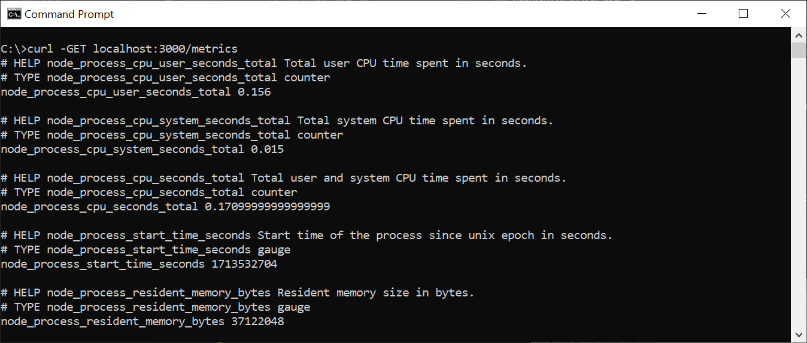

This repository contains a simple Node.js application that shows you how to generate metrics in Prometheus format.

Test run the application and it worked perfectly.

Steps to test run the application:
- Open the node folder using VS Code.
- Open a new VS Code Terminal and ensure that you are in the node directory.
- In the terminal, type:
``` sh
node server.js
```
- You will see a response message from Node:
``` sh
Example api is listening on http://localhost:3000, metrics are exposed on http://localhost:3000/metrics
```
- Open a Command Prompt Window and type the command:
``` sh
curl -GET localhost:3000/metrics
```

- Here is the output:


- Alternatively, you can open a browser and type the command at the address bar:
``` sh
http://localhost:3000/metrics
```
- Here is the output:

